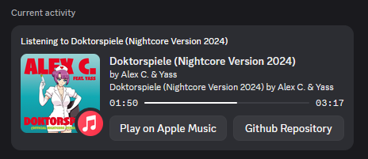

# Apple Music RPC for Discord

A lightweight, cross-platform desktop application written in Rust that displays your current Apple Music playback status as a Rich Presence profile on Discord.

## Download

| Platform | Architecture | Download Link |
| :--- | :--- | :--- |
| **Windows** | x64 | [Download .exe](https://github.com/sudoabc/apple_music_rpc/releases/latest/download/apple_music_rpc_windows.exe) |
| **macOS** | Intel (x86_64) | [Download .d,g (Intel)](https://github.com/sudoabc/apple_music_rpc/releases/latest/download/AppleMusicRPC_x86_64.dmg) |
| **macOS** | Apple Silicon (ARM64) | [Download .dmg (ARM64)](https://github.com/sudoabc/apple_music_rpc/releases/latest/download/AppleMusicRPC_arm64.dmg) |

## Features

- **Real-Time Updates**: Automatically fetches and displays the current track, artist, and playback status.
- **Cross-Platform**: Fully supports both **Windows** and **macOS**.
- **Silent Mode**: Runs quietly in the background with no terminal window.
- **System Tray Integration**: Manage the application directly from your taskbar/menu bar with a built-in tray icon.
- **Lightweight**: Built with Rust for minimal CPU and RAM usage.

## Installation

You can download older pre-compiled binaries from the [Releases](../../releases) page.

### For Windows
1. Download `apple_music_rpc_windows.exe` from the latest release.
2. Double-click to run. The app will appear in your System Tray (bottom right, near the clock).
3. **Optional (Start on boot):** Press `Win + R`, type `shell:startup`, and place a shortcut to the `.exe` inside that folder.

### For macOS
1. Download the `.dmg` file corresponding to your Mac's processor (Intel or Apple Silicon).
2. Double-click the downloaded `.dmg` file to mount it.
3. Drag and drop the application icon into your `Applications` folder.
4. Eject the disk image and open the app from Launchpad or Finder.

> [!IMPORTANT]
> If macOS prevents the app from opening because it's from an "unidentified developer", right-click the app in Finder and select **Open**. Alternatively, go to System Settings > Privacy & Security and click "Allow Anyway".

## Technologies Used

- Rust
- `tokio` for async runtime
- `tray-icon` & `tao` for cross-platform system tray support

## License

This project is licensed under the MIT license.